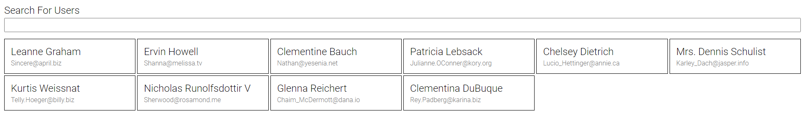
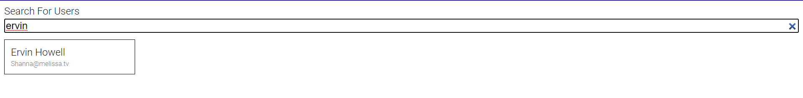
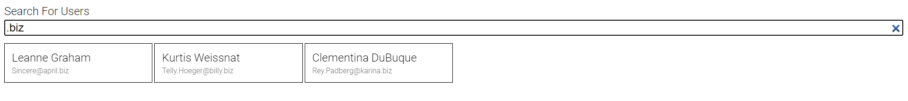
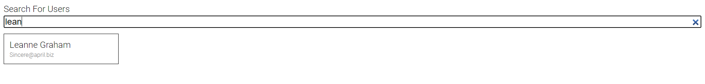

# Search Bar Concept Screenshots

> If nothing is inputted in the search bar, all data is present.

> The search bar is able to display the correct data written regardless of case sensitivity. As you can see Ervin data is the only one displayed.

> The search bar was able to display all the users with a .biz email.

> The search bar is able to dynamically update and produce results even when user has not completely inputted the user name.

 

The user data sample is from here: https://jsonplaceholder.typicode.com/users

Preview It Here: https://renlumfao.com/search-project.html
